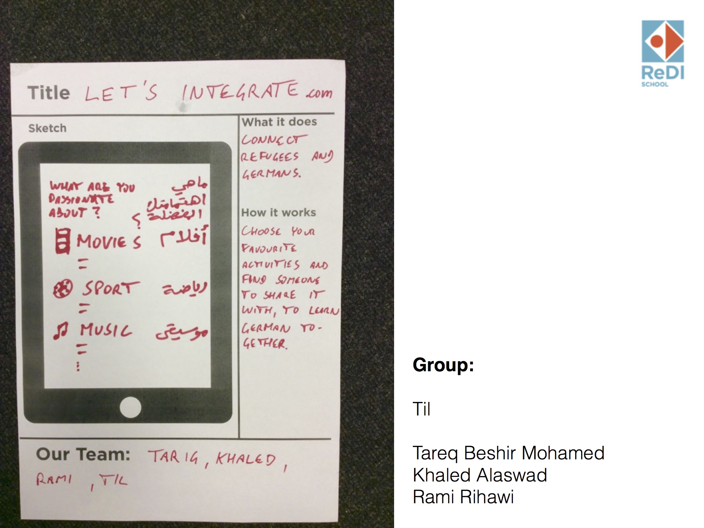
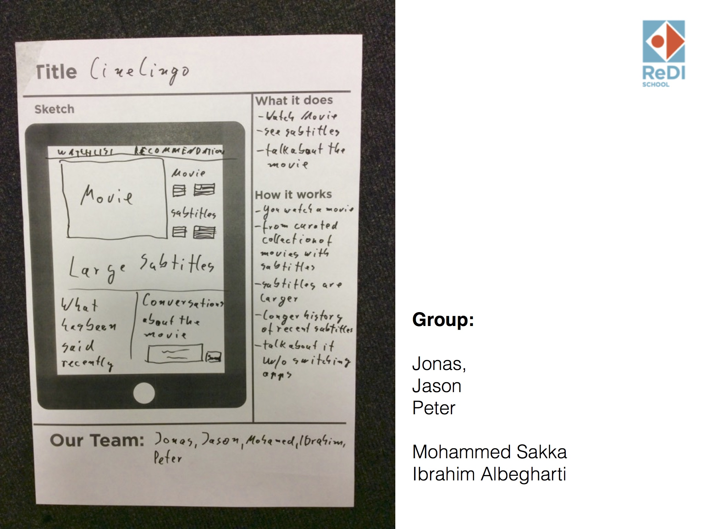

# ReDI Ruby Class - Group 1

## Sun 2015-03-20 (Til)

The fundamentals of Rails - everything one needs to know to add a
resource. Following this presentation
[redi-rails](https://tils.net/redi-rails/redi-rails.html) (no source
code online). At the end there was a longer practice session, adding a
resource to a fresh new rails app (a blog with posts).

## Thu 2015-03-17 (Jonas)

## Wed 2015-03-16 (Til fill-in)

HTML and CSS practice, students mostly on their own researching and
trying to implement their own design ideas. Continued on the
hello-html-and-css-world practice project.

## Sun 2015-03-13 (Jonas)

## Thu 2015-03-10

## Wed 2015-03-09

## Sun 2015-03-06 (Til)

We started with a short recap of homework, then spent the rest of the
day with basic HTML and CSS.

We followed this presentation on
[HTML and CSS](https://tils.net/html-and-css-presentation/html-and-css.html). (On GitHub:
[presentation source code](https://github.com/til/html-and-css-presentation)).

To practice, everyone checked out this repository, which contained
empty pages and empty css files:
[hello-html-and-css-world](https://github.com/ReDI-School/hello-html-and-css-world/).
Some pushed their changes at the end, but that was not the main focus
of the session.

Key concepts covered (see presentation for all)

* basic html structure
* basic html tags
* static pages
* relative links and image references
* css selectors

Homework: further experiment with the hello-html-and-css-world files
locally, possibly add content that could be part of their projects.

## Thu 2015-03-03 - Mentoring Session (Jonas)

## Wed 2015-03-02 - Mentoring Session (Petr)
* Standup
    * Quick introduction
    * Check if everybody was successful with HW
* Individual problems solving
    * Mostly GIT
* HTML
    * Everybody was on
      [www.freecodecamp.com](http://www.freecodecamp.com/),
      logged in and tried first few tasks
* CSS
    * How to define styles:
        * In HTML tag attribute
        * In style tag
        * In separate spreadsheet
* Homework
    * Make 2 columns layout for your page, left side is static, right side is scrollable

## Sun 2015-02-28 (Jonas)

## Thu 2015-02-25 - Mentoring Session (Jonas)

## Wed 2015-02-24 - Mentoring Session (Peter)
* Open Panel
    * What did you build recently?
    * What did you learn recently?
* Q&A Session
* short break
* Digging into Ruby
    * Team up in groups of 2 (it's called pair programming)
    * Complete the following exercises (from [Learn Ruby the Hard Way](http://learnrubythehardway.org/book/)):
        * Group A: Exercise 1, 4, 6, 18, 28, 29
        * Group B: Exercise 1, 4, 7, 19, 28, 32
        * Group C: Exercise 1, 4, 8, 21, 28, 33
    * Share what you have learned with the rest of the groups    
* Wrap up and introduction of assignment    

### Photo Protocol

### Assignment for Tomorrow
* Go to [https://github.com/ReDI-School/hello-world](https://github.com/ReDI-School/hello-world)
* Follow the instructions on the bottom of the page

### Self assessment
Please complete the following quizzes before the next session on Sunday:

* [Variables, Strings, Numbers](http://www.codequizzes.com/learn-ruby/variables-strings-numbers)                             
* [Arrays, conditionals, loops](  http://www.codequizzes.com/learn-ruby/arrays-conditionals-loops)
* [Symbols, array methods, hashes](http://www.codequizzes.com/learn-ruby/symbols-array-methods-hashes)

## Sun 2016-02-21 (Til)

Curriculum is not fully determined yet, especially for the accelerated groups
Today, let's build a Ruby on Rails app

We go through this tutorial together: [guides.railsgirls.com/app](http://guides.railsgirls.com/app)
What we will cover

Build a Rails app by example. Intro to Rails concepts.
By the end

You will know how to create new rails apps and have an overview over the basic structure and functionality of rails.

* a web app to store ideas
* use so-called scaffolding to generate code
* with picture upload
* with fancy bootstrap styling
* replace railsgirls with redi
* replace ideas with something else if you want
* Optionally: deploy the rails app to heroku

Everyone on their own laptop

Whenever there is something unclear or you are stuck: ask!

Please help each other! I'll help you too of course.

Today's project is a throwaway. We'll start with a real project later
Homework

Read Ruby in 100 Minutes [http://tutorials.jumpstartlab.com/projects/ruby_in_100_minutes.html](http://tutorials.jumpstartlab.com/projects/ruby_in_100_minutes.html)

(Download it now, so that you don't need internet later.)

`wget -l 1 -k -r http://tutorials.jumpstartlab.com/projects/ruby_in_100_minutes.html`

### Self Study and Further Reading
#### Using command line and terminal

* [http://www.learnenough.com/command-line-tutorial](http://www.learnenough.com/command-line-tutorial) - for complete beginners
* [http://cli.learncodethehardway.org/book/](http://cli.learncodethehardway.org/book/) - step by step tutorial, has a little exercise for each command
* [http://ryanstutorials.net/linuxtutorial/](http://ryanstutorials.net/linuxtutorial/) - thorough tutorial, also goes into vi use and scripting
* [http://ryanstutorials.net/linuxtutorial/cheatsheet.php]( http://ryanstutorials.net/linuxtutorial/cheatsheet.php) - cheatsheet from above tutorial

## Sun 2016-02-14 - Ideation Session (all)
In this session we will

* Identify worthy problems to solve
* Cluster these problems into topics
* Generate lots of ideas for each of these topics
* Devlep a pen and paper prototype of how the problems could be solved

### Photo Protocol

